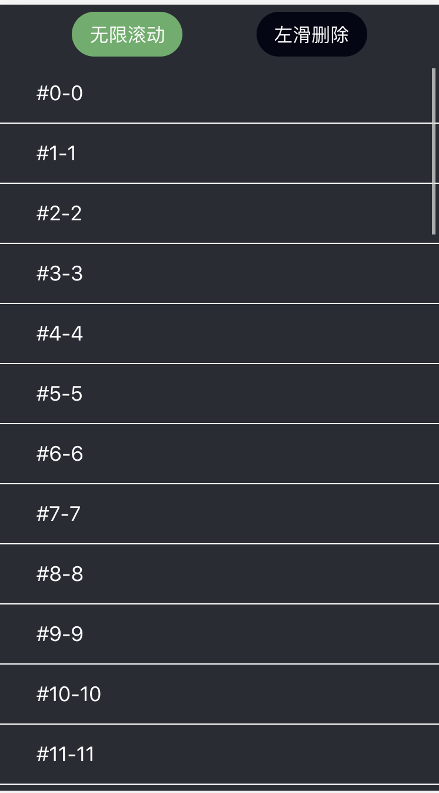

# Overview
`scroll-list` build with react and typescript. Supports infinate scroll.
## Getting Started

### Installation
```bash
yarn
```
### Dev

```bash
yarn run start
```

### build

```
yarn run build
```

## Design Docs
[See more](./docs/design.md)

## API

### Prop Types

| Property      | Type          | Required  | Description |
| ------------- |:-------------:| :---------: | ---------- |
| data          | Array         |     ✓     | Data to render list |
| height        | Number        |     ✓     | heiget of the scroll list container |
| renderItem    | Function      |     ✓     | Render each row in list `(item: {item: any, index: number }) => any` |
| keyExtractor  | Function      |           | Used to generate a unique key. The deault is `item.key` if exists, otherwise  fall backs to `index` |
| estimateRowHeight | Number    |     ✓     | Used to estimate dynamic row height. |
| onScroll      | Function      |           | Will be called when scrolling. `(item: {viewport: number, scrollTop: number }) => void`  |
| onViewableItemsChanged | Function |       | Called when viewable items changed, `(info: {viewableItems: any[], start: number, end: number }) => void` |
| onEndReachedThreshold  | Number   |       | Determines how far from the end to trigger the `onReachedEnd`, Default is `5` |
| onEndReached  | Function      |           | Called when the left unrendered item gets within the `onEndReachedThreshold` |


## Feature
### 1. Infinate Scroll

```typescript
import { ScrollList, ScrollListProps } from 'scroll-list';

function App() {
  const [data, setData] = useState(new Array(100).fill(0).map((value, index) => ({ index })));
  const ref = useRef<ScrollList>(null);

  const renderItem: ScrollListProps['renderItem'] = ({ item, index }) => {
    return (
      <div className="item">
        {'#' + index + '-' + item.index }
      </div>
    );
  };

  // place your fetching data logic
  const onEndReached = () => {
    setData([...data, ...new Array(100).fill(0).map((value, index) => ({ index: data.length + index }))])
    console.log('end reached');
  };

  return (
    <div>
      <ScrollList
        ref={ref}
        renderItem={renderItem}
        data={data}
        height={window.innerHeight}
        onEndReached={onEndReached}
        estimateRowHeight={50}
      />
    </div>
  );
}

```

### 2. Swipe to delete

```typescript
import { ScrollList, ScrollListProps } from './List';
import Swiper from './Swiper';

function App() {
  const [data, setData] = useState(new Array(100).fill(0).map((value, index) => ({ index })));
  const [currentIndex, setCurrentIndex] = useState(-1);
  const ref = useRef<ScrollList>(null);

  const renderItem: ScrollListProps['renderItem'] = ({ item, index }) => {
    return (
      <Swiper
        selected={currentIndex === index}
        threshold={60}
        onSelect={() => setCurrentIndex(index)}
        onDelete={() => {
          const items = [...data];
          items.splice(index, 1);
          if (ref.current) {
            ref.current.deleteRow(index);
          }
          setCurrentIndex(-1);
          setData(items);
        }}
      >
        <div className="item">
          {'#' + index + '-' + item.index }
        </div>
      </Swiper>
    )
  };

  const onEndReached = () => {
    setData([...data, ...new Array(100).fill(0).map((value, index) => ({ index: data.length + index }))])
    console.log('end reached');
  };

  return (
    <ScrollList
      ref={ref}
      renderItem={renderItem}
      data={data}
      height={window.innerHeight - 50}
      onEndReached={onEndReached}
      estimateRowHeight={50}
    />
  );
}

```
## Peview

Scan the QR code to test live demo<br/>


<br/>

