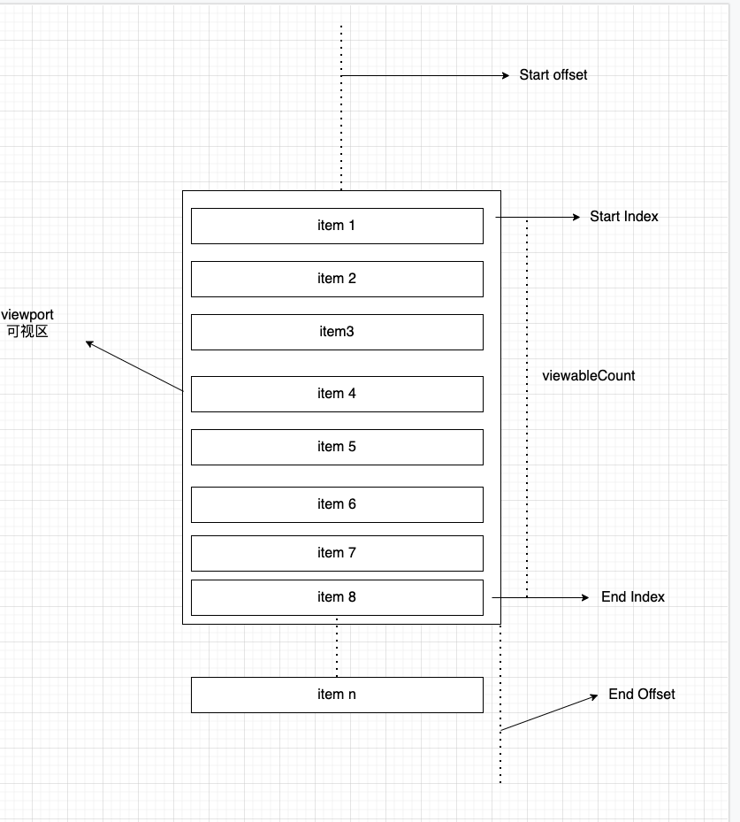

## Design Proposal

借鉴 virtual list 原理，每次滚动渲染，只渲染部分数据(可见区域).

- `startIndex` 标识可视区域渲染的第一个元素
- `endIndex` 标识可视区域的渲染的最后一个元素，为了滚动体验，会在此基础上额外加个 buffer, 多渲染几个 item
- `viewableCount` 根据 `estimateRowHeight` 计算的需要渲染的元素个数，`viewableCount = Math.ceil(height / estimateRowHeight) + buffer`
- `startOffset` 滚动区域距离容器的顶部偏移量
- `endOffset` 滚动区域距离容器底部的偏移量

## 可优化项
- 使用 `Intersection Observer` API 代替 onscroll 处理滚动事件
- 兼容 `img`, img 渲染后需要重新计算高度

## Reference
[再谈前端虚拟列表的实现](https://zhuanlan.zhihu.com/p/34585166)
[React Native - Flatlist](https://reactnative.dev/docs/flatlist)
[react-virtualized](https://github.com/bvaughn/react-virtualized)
[UITableView](https://developer.apple.com/documentation/uikit/uitableview)
